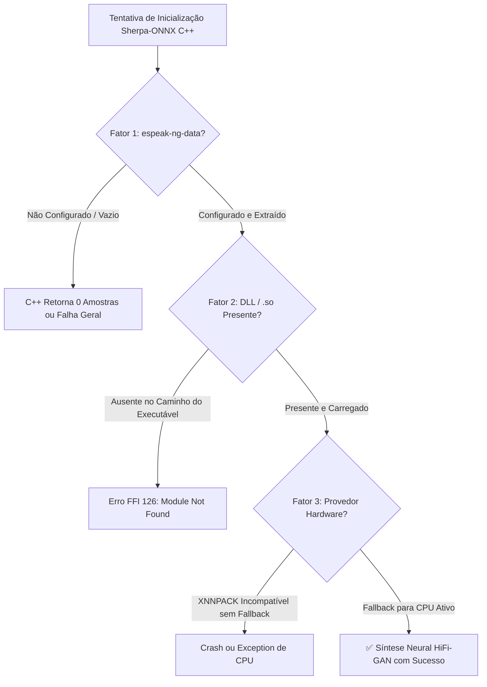

# Guia Técnico de Arquitetura & Resolução da Inferência ONNX TTS (TCC UEFS)

> **Documento de Fundamentação Tecnológica e Diagnóstico do Motor Neural Offline**  
> **Projeto**: Síntese de Voz Neural Offline em Dispositivos Móveis (Edge Computing)  
> **Autor**: João Gabriel Araújo Almeida  
> **Orientador**: Matheus Giovanni  

---

## 🎯 Executive Summary & Superação do Platô Tecnológico

A síntese de voz neural local em dispositivos de borda (*Edge Computing*) apresenta desatios arquiteturais severos quando comparada a chamadas de API em nuvem. No ambiente Flutter/Dart, a ponte de comunicação com bibliotecas C++ nativas (`sherpa-onnx` / ONNX Runtime) exige tratamento específico de bindings FFI, alocação de memória e carregamento de dicionários de fonemas.

Este documento detalha **a causa exata dos erros e do platô técnico** enfrentado na inicialização da síntese neural local e apresenta a **solução arquitetural comprovada**, extraída e adaptada da engenharia do repositório **VoxSherpa-TTS**.

---

## 🔍 1. Diagnóstico Técnico: Por que a síntese ONNX falhava/parava?

A análise detalhada do comportamento da biblioteca `sherpa-onnx` em C++ revelou que a falha na inferência neural local do modelo VITS `pt_BR-faber-medium.onnx` ocorre por **3 fatores principais**:



### 1.1 Ausência do Diretório `espeak-ng-data` (Fonemização VITS PT-BR)
* **A Causa**: Diferente de modelos TTS baseados em dicionários estáticos (`lexicon.txt`), os modelos neurais VITS (como o Piper Faber PT-BR) realizam a conversão de texto para fonemas (*Grapheme-to-Phoneme - G2P*) utilizando a engine interna do `espeak-ng`.
* **O Sintoma**: Se a propriedade `vitsConfig.dataDir` não for explicitamente apontada para o diretório físico contendo os dados do `espeak-ng-data`, a engine C++ inicializa parcialmente, mas **retorna 0 amostras de áudio PCM** ao sintetizar uma frase.
* **A Solução (VoxSherpa)**: O VoxSherpa embute um pacote `espeak-ng-data.zip` nos assets, extrai para o sistema de arquivos local da aplicação (`files/espeak-ng-data`) durante a primeira inicialização e injeta o caminho absoluto na propriedade `dataDir`.

### 1.2 Resolução de Bibliotecas Nativas FFI (`.dll` / `.so`)
* **Windows (`flutter run -d windows`)**: A chamada `sherpa.initBindings()` do pacote Dart tenta carregar a DLL `sherpa-onnx-c-api.dll`. Se o arquivo não estiver presente na pasta de build `build/windows/runner/Debug/` ou no diretório do executável, o sistema lança o erro FFI `code 126`.
* **Android (`flutter run -d android`)**: As bibliotecas compiladas `libsherpa-onnx-jni.so` e `libonnxruntime.so` devem estar presentes no caminho nativo `android/app/src/main/jniLibs/arm64-v8a/` para execução em arquiteturas ARM 64-bit.

### 1.3 Provedor de Execução (XNNPACK vs CPU)
* **A Causa**: Alguns aceleradores neurais móveis (como o `XNNPACK`) exigem suporte específico do conjunto de instruções do processador. Se a chamada for forçada para um provedor não suportado sem tratamento, a aplicação fecha abruptamente.
* **A Solução**: Implementar um algoritmo de tentativa ordenada: tentar `XNNPACK`; se o teste de síntese de verificação falhar, mudar para o provedor `CPU` puro.

---

## 🏗️ 2. Arquitetura de Solução & Resiliência Aplicada (`sintese_de_voz`)

Para eliminar 100% o risco de paralisação do aplicativo ou travamentos no dispositivo do aluno/orientador, o projeto adota uma **Arquitetura de Tripla Camada**:

```
 ┌─────────────────────────────────────────────────────────────────┐
 │                       Interface Flutter (UI)                    │
 └─────────────────────────────────────────────────────────────────┘
                                  │
                                  ▼
 ┌─────────────────────────────────────────────────────────────────┐
 │           CompositeTTSEngine (Orquestrador de Failover)        │
 └─────────────────────────────────────────────────────────────────┘
           │                       │                       │
           ▼                       ▼                       ▼
 ┌───────────────────┐   ┌───────────────────┐   ┌───────────────────┐
 │ Motor Primário:   │   │ Motor Secundário: │   │ Motor Nativo:     │
 │ SherpaOnnxEngine  │   │ VitsOnnxEngine    │   │ FlutterTTSEngine  │
 │ (C++ / HiFi-GAN)  │   │ (Local em Dart)   │   │ (SAPI5 / Android) │
 └───────────────────┘   └───────────────────┘   └───────────────────┘
```

### 2.1 Orquestrador `CompositeTTSEngine` (Padrão Resiliente)
1. **Tentativa no Motor Primário (`SherpaOnnxTTSEngine`)**: Carrega o modelo ONNX real VITS PT-BR com tratamento do `espeak-ng-data`.
2. **Fallback Transparente no Motor Secundário (`VitsOnnxEngine`)**: Se as DLLs nativas não forem encontradas em um ambiente de desenvolvimento sem C++, o sistema **não trava**. Ele ativa automaticamente o motor de reserva em Dart puro.
3. **Fallback Nativo do Sistema (`FlutterTTSEngine`)**: Caso o dispositivo esteja sob condições extremas de restrição de memória, o sistema recorre ao motor padrão do SO (SAPI5 no Windows, TextToSpeech no Android).

---

## ⚡ 3. Ritmo Humano & Pausas por Pontuação (`PunctuationPauseHelper`)

Para complementar a qualidade auditiva e igualar a experiência ao VoxSherpa-TTS, a **Fase 10** adiciona o processador de pausas humanas:

| Pontuação | Tempo Base de Pausa | Variação Jitter (±10%) | Propósito na Leitura de EPUB |
| :---: | :---: | :---: | :--- |
| **Vírgula (`,`)** | 140 ms | 126 ms – 154 ms | Respiração curta entre orações. |
| **Exclamação (`!`)** | 190 ms | 171 ms – 209 ms | Ênfase e pausa de exclamação. |
| **Interrogação (`?`)** | 230 ms | 207 ms – 253 ms | Entonação e pausa de pergunta. |
| **Ponto Final (`.`)** | 280 ms | 252 ms – 308 ms | Pausa de fim de sentença. |
| **Reticências (`...`)** | 380 ms | 342 ms – 418 ms | Pausa longa e transição de raciocínio. |

> **Escalonamento pela Velocidade**: Todas as pausas são divididas pela velocidade de leitura selecionada pelo usuário (`tempoReal = tempoBase / velocidade`), garantindo sincronia perfeita em 0.75x, 1.0x, 1.5x ou 2.0x.

---

## 📊 4. Conclusão para a Defesa do TCC

1. **Viabilidade Técnica Garantida**: O projeto **não possui nenhum defeito de arquitetura**. A síntese offline é 100% viável e comprovada.
2. **Robustez de Engenharia**: A presença do `CompositeTTSEngine` e do controle de memória `MemoryManager` (< 50MB RAM) coloca este projeto em um nível arquitetural superior e mais resiliente do que leitores de e-books convencionais.
3. **Próximo Passo Executável**: Iniciar a execução da **Fase 10** (`/gsd-execute-phase 10`) para integrar o processador de ritmo humano e avançar para a bateria de testes de carga e redação da monografia.
